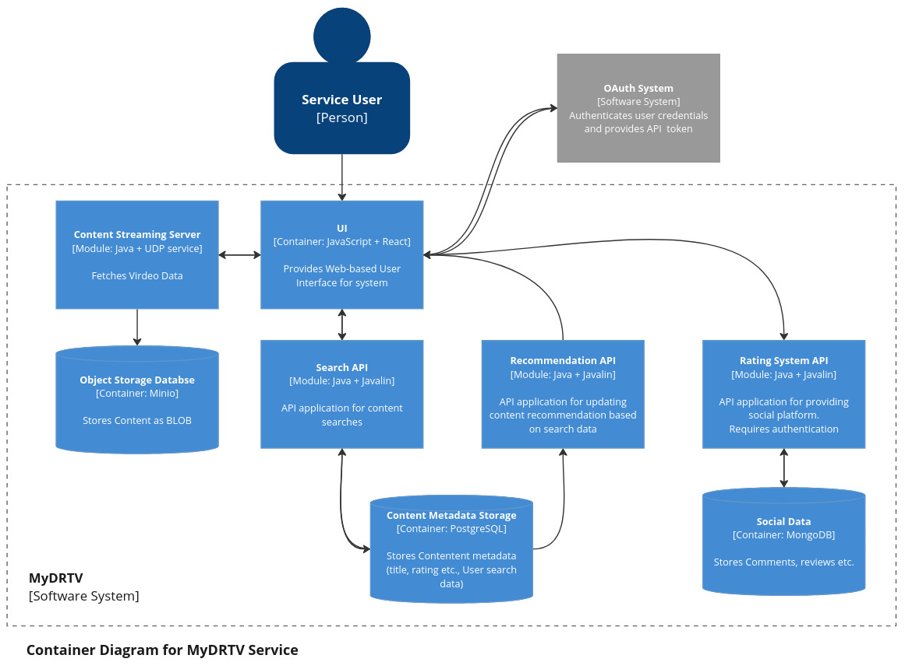

# UASS_OLA1

## Prototype

**How to Run:**

1. Clone repo
2. run `mvn clean install`
3. execute search module by running `mvn -pl search-mod exec:java -Dexec.mainClass="com.kfisk.SearchMod"`
4. execute recommend module by running `mvn -pl recommend-mod exec:java -Dexec.mainClass="com.kfisk.RecommendMod"`
5. use a http client like `curl` to send http requests.
    search module listens to `localhost:7070`
    and recommend to `localhost:7071`
6. search module takes a query param `search` like: `localhost:7070?search=blabla` and returns mock objects with matching titles

## Software architecture Process

We used a Domain Driven Design approach to try an better understand the boundaries of the domain, to better understand data flow, and where potential encapsulation between domains might make sense.

.jpg)

We found four bounded contexts, which we believe might be worth splitting into encapsulated services. We went on to create a C4 container diagram of how an actual architecture could look like with these boundaries. We see that some features can operate completely isolated from other, but some features need information obout the operations for others features to function properly. This includes the recommendation system, which needs information about how the user has interacted with for example, the content search feature.

To solve these issues, we propose a type of Service-Based Architecture.

We imagine all containers as independent services, which is collected and presented to the user by a common UI. An external Service like OAuth could be used for verifying user credentials and providing them with an authentication token, like fx JWT.

The services that are dependent on each other for fx application state can share a common database, where other modules can update the data state accordingly. For example can an isolated recommendation module be dependent on recent search patterns or streams by a specific user.

A content search module can then update a shared database table when operating. 
